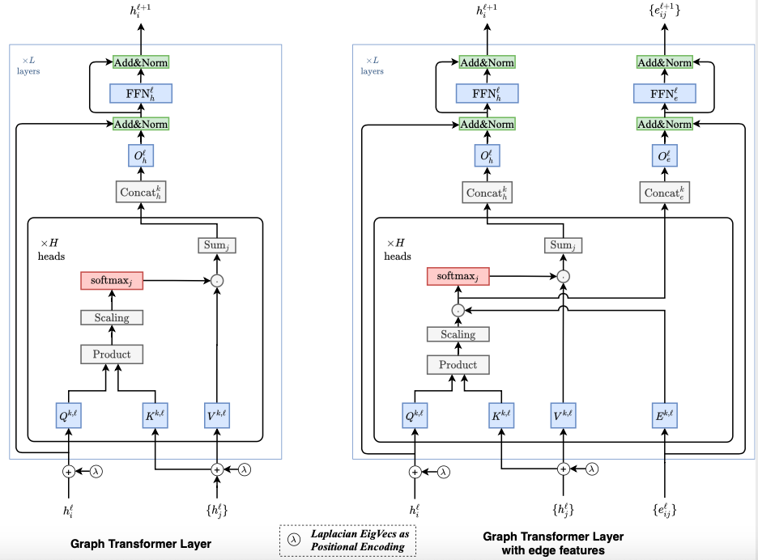

>Notice: This is research code that will not necessarily be maintained in the future.
>The code is under development so make sure you are using the most recent version.
>We welcome bug reports and PRs but make no guarantees about fixes or responses.

DESCRIPTION
===========
```gt_pyg``` is an implementation of the Graph Transformer Architecture in [Pytorch Geometric](https://pytorch-geometric.readthedocs.io/en/latest/).

<p align="center"></p>
This sketch provides an overview of the Graph Transformer Architecture (Dwivedi, Bresson, 2021)


INSTALL
=======

Clone and install the software:
```
git clone https://github.com/pgniewko/gt-pyg.git
pip install .
```

Create and activate the conda environment:
    
```
conda env create -f environment.yml
conda activate gt
```


USAGE
=====

The following code snippet demonstrates how to test the installation of gt-pyg and the usage of the GTConv layer.

```python
import torch
from torch_geometric.data import Data
from gt_pyg.nn.gt_conv import GTConv

num_nodes = 10
num_node_features = 3
num_edges = 20
num_edge_features = 2

# Generate random node features
x = torch.randn(num_nodes, num_node_features)

# Generate random edge indices
edge_index = torch.randint(high=num_nodes, size=(2, num_edges))

# Generate random edge attributes (optional)
edge_attr = torch.randn(num_edges, num_edge_features)

gt = GTConv(node_in_dim=num_node_features, 
            edge_in_dim=num_edge_features,
            hidden_dim=15, 
            num_heads=3)
gt(x=x, edge_index=edge_index, edge_attr=edge_attr)
```

The complete example, which demonstrates the usage of the GTConv layer in a model and training a regression model for the ADME task in the Therapeutics Data Commons, can be found in this [notebook](https://github.com/pgniewko/gt-pyg/blob/main/nbs/GT-TDC-ADME.ipynb).


IMPLEMENTATION NOTES
====================

1. The code aims to faithfully replicate the original [GTConv layer](https://github.com/xbresson/CS6208_2023/blob/main/codes/labs_lecture07/03_graph_transformers_regression_exercise.ipynb) as closely as possible.                      
  a. There is no need for clipping in the softmax function since the softmax procedure in PyG employs the Log-Sum-Exp trick, effectively mitigating any potential risk of overflow.                    
  b. Additional details on implementing message passing layers in `pytorch-geometric` can be found on the [pyg website](https://pytorch-geometric.readthedocs.io/en/latest/notes/create_gnn.html).               

2. Some implementation techniques are borrowed from the [TransformerConv](https://github.com/pyg-team/pytorch_geometric/blob/master/torch_geometric/nn/conv/transformer_conv.py) module in the PyTorch-Geometric codebase.

3. To convert SMILES into a tensor code, one option is to utilize the [from_smiles](https://pytorch-geometric.readthedocs.io/en/latest/modules/utils.html#torch_geometric.utils.from_smiles) method. However, the current featurization approach lacks flexibility; It necessitates the creation of multiple embeddings, which are then summed instead of employing a single Linear layer.

4. To maintain simplicity, we forgo creating a separate DataSet object since we are working with small datasets. Instead, we pass a list of Data objects to the DataLoader, as explained in the [documentation](https://pytorch-geometric.readthedocs.io/en/latest/tutorial/create_dataset.html).

5. The compound cleaning procedure drew inspiration from Pat Walter's [blog-post](https://practicalcheminformatics.blogspot.com/2023/06/getting-real-with-molecular-property.html).


REFERENCES
==========
1. [A Generalization of Transformer Networks to Graphs](https://arxiv.org/abs/2012.09699)
2. [What Uncertainties Do We Need in Bayesian Deep Learning for Computer Vision?](https://arxiv.org/abs/1703.04977)
3. [Therapeutics Data Commons](https://arxiv.org/abs/2102.09548)


COPYRIGHT NOTICE
================
Copyright (C) 2023-, Pawel Gniewek                 
Email: gniewko.pablo@gmail.com                          
License: MIT                      
All rights reserved.                     
