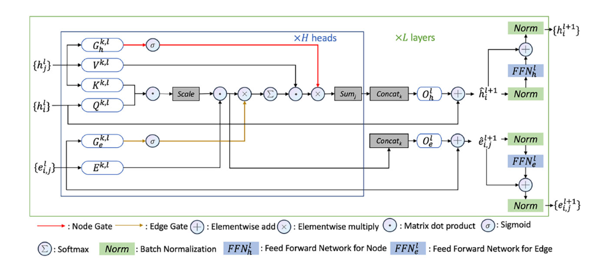

>Notice: This is research code that will not necessarily be maintained in the future.
>The code is under development so make sure you are using the most recent version.
>We welcome bug reports and PRs but make no guarantees about fixes or responses.

DESCRIPTION
===========
```gt_pyg``` is an implementation of the Graph Transformer Architecture in [Pytorch Geometric](https://pytorch-geometric.readthedocs.io/en/latest/).

<p align="center"></p>        

This sketch provides an overview of the Graph Transformer Architecture (Dwivedi, Bresson, 2021). In a nutshell, the model is implementing a dot product self-attention network with the `softmask` function (`softmask` is a `softmax` applied only over the non-zero elements of the `(A+I)` matrix).                

<p align="center"></p>

This sketch is an overview of the gating mechanism used in the GT model (Chen, et al., 2023, Bioinformatics).

INSTALL
=======

Clone and install the software:
```
git clone https://github.com/pgniewko/gt-pyg.git
pip install .
```

Create and activate the conda environment:
    
```
conda env create -f environment.yml
conda activate gt
```


USAGE
=====

The following code snippet demonstrates how to test the installation of gt-pyg and the usage of the GTConv layer.

```python
import torch
from torch_geometric.data import Data
from gt_pyg.nn.gt_conv import GTConv

num_nodes = 10
num_node_features = 3
num_edges = 20
num_edge_features = 2

# Generate random node features
x = torch.randn(num_nodes, num_node_features)

# Generate random edge indices
edge_index = torch.randint(high=num_nodes, size=(2, num_edges))

# Generate random edge attributes (optional)
edge_attr = torch.randn(num_edges, num_edge_features)

gt = GTConv(node_in_dim=num_node_features, 
            edge_in_dim=num_edge_features,
            hidden_dim=15, 
            num_heads=3)
gt(x=x, edge_index=edge_index, edge_attr=edge_attr)
```

The complete example, which demonstrates the usage of the GTConv layer in a model and training a regression model for the ADME task in the Therapeutics Data Commons, can be found in this [notebook](https://github.com/pgniewko/gt-pyg/blob/main/nbs/GT-TDC-ADME.ipynb).


The code works with custom datasets. Let's assume we have a file called `solubility.csv` with two columns: `SMILES` and `logS`. We can prepare a training `DataLoader` object with the following code.
```python
fn = 'solubility.csv'
x_label='SMILES'
y_label='logS'
dataset = get_data_from_csv(fn, x_label='SMILES', y_label='logS')
tr_dataset = get_tensor_data(dataset[x_label], dataset[y_label].to_list(), pe_dim=6)
train_loader = DataLoader(tr_dataset, batch_size=256)
```

WEIGHT WATCHER 
==============
The main idea originates from the [Weight Watcher lecture](https://www.youtube.com/watch?v=Tnafo6JVoJs&ab_channel=SanFranciscoBayACM), which suggests using per-layer alpha exponents to control the training process. The premise is that if the per-layer alphas fall within the range of `[2, 6]`, the network is well-trained, indicating that the deep neural network (DNN) has successfully captured long-range, scale-invariant correlations between the neural network parameters, input data, and the output labels.

The idea [developed](https://github.com/pgniewko/gt-pyg/blob/8dbb7bc684f84e0692bb8db14fc33c6de7ffdc18/gt_pyg/util/ww_utils.py#L61) here is rather simple: whenever a layer's `alpha` is within the desired range, we decrease the learning rate to effectively "capture" the weights in this spectral range. Conversely, when the `alpha` falls outside of this range, we increase the learning rate so that the layer's weights are modified more rapidly.

We have empirically [demonstrated](https://github.com/pgniewko/gt-pyg/blob/main/nbs/GT-WW.ipynb) that this simple procedure indeed leads to capturing the spectral exponents of the layers within the desired range. It is hypothesized that networks regularized in this way exhibit better generalization capabilities.


MoleculeACE
===========
The repository also contains a notebook and an example of how to run the (in)famous MoleculeACE benchmark. You can find it [here](https://github.com/pgniewko/gt-pyg/blob/main/nbs/GT-MoleculeACE.ipynb). Enjoy!


IMPLEMENTATION NOTES
====================

1. The code aims to faithfully replicate the original [GTConv layer](https://github.com/xbresson/CS6208_2023/blob/main/codes/labs_lecture07/03_graph_transformers_regression_exercise.ipynb) as closely as possible.                      
  * There is no need for clipping in the softmax function since the softmax procedure in PyG employs the Log-Sum-Exp trick, effectively mitigating any potential risk of overflow.                    
  * Additional details on implementing message passing layers in `pytorch-geometric` can be found on the [pyg website](https://pytorch-geometric.readthedocs.io/en/latest/notes/create_gnn.html).              
  * In the original paper, only the `sum` is used for message aggregation. Drawing inspiration from the [PNA model](https://arxiv.org/abs/2004.05718), the user can utilize a set of aggregators.                
  * The current implementation adds a gating mechanism (after Chen et al. 2023, Bioinformatics) and sets biases in the attention mechanism to `False` (after Jumper et al, 2021, Science). To reproduce the original GT paper, set `qkv_bias=True`, and `gate=False`.                   

2. Some implementation techniques are borrowed from the [TransformerConv](https://github.com/pyg-team/pytorch_geometric/blob/master/torch_geometric/nn/conv/transformer_conv.py) module in the PyTorch-Geometric codebase.

3. To convert SMILES into a tensor code, one option is to utilize the [from_smiles](https://pytorch-geometric.readthedocs.io/en/latest/modules/utils.html#torch_geometric.utils.from_smiles) method. However, the current featurization approach lacks flexibility; It necessitates the creation of multiple embeddings, which are then summed instead of employing a single Linear layer.

4. To maintain simplicity, we forgo creating a separate DataSet object since we are working with small datasets. Instead, we pass a list of Data objects to the DataLoader, as explained in the [documentation](https://pytorch-geometric.readthedocs.io/en/latest/tutorial/create_dataset.html).

5. The compound cleaning procedure drew inspiration from Pat Walter's [blog-post](https://practicalcheminformatics.blogspot.com/2023/06/getting-real-with-molecular-property.html).             

6. The test loss is calculated using [TorchMetrics](https://sebastianraschka.com/blog/2022/torchmetrics.html) for convenience.       

7. **Note**: The order in which batch/layer normalization is executed is a topic of debate in the Deep Learning literature. The current implementation in this work utilizes the Post-Normalization Transformer layer, as opposed to Pre-Normalization. Although it is claimed that pre-normalization works better, this assertion has not been verified in this particular study. For additional references, please refer to the [Graphorer](https://arxiv.org/abs/2106.05234) paper or a more comprehensive study conducted by [Xiong et al.](https://arxiv.org/abs/2002.04745).                  

REFERENCES
==========
1. [A Generalization of Transformer Networks to Graphs](https://arxiv.org/abs/2012.09699)
2. [A gated graph transformer for protein complex structure quality assessment and its performance in CASP15](https://academic.oup.com/bioinformatics/article/39/Supplement_1/i308/7210460)
3. [What Uncertainties Do We Need in Bayesian Deep Learning for Computer Vision?](https://arxiv.org/abs/1703.04977)
4. [Therapeutics Data Commons](https://arxiv.org/abs/2102.09548)
5. [WeightWatcher](https://weightwatcher.ai/)

COPYRIGHT NOTICE
================
Copyright (C) 2023-, Pawel Gniewek                 
Email: gniewko.pablo@gmail.com                          
License: MIT                      
All rights reserved.                     
